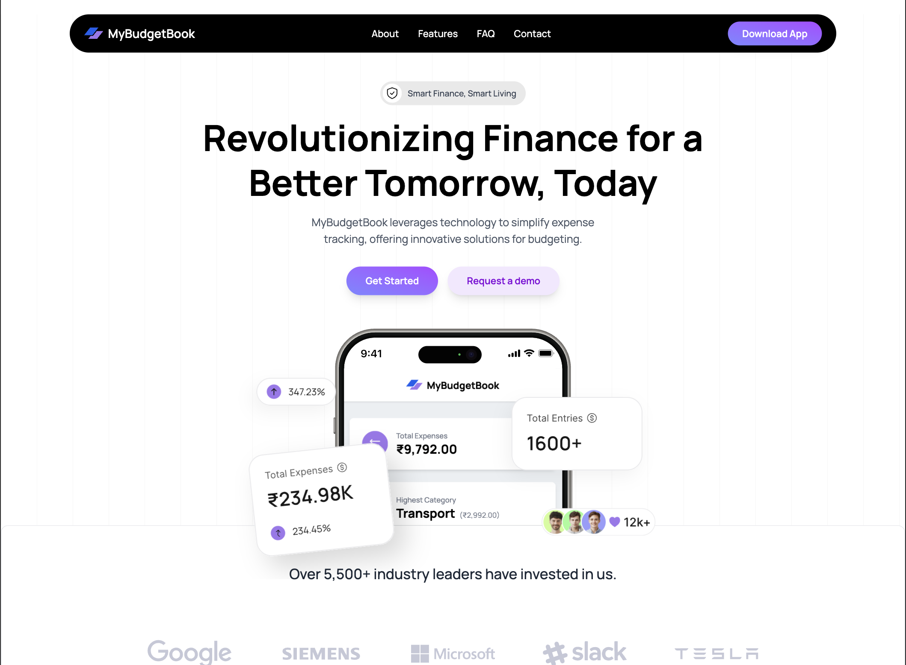
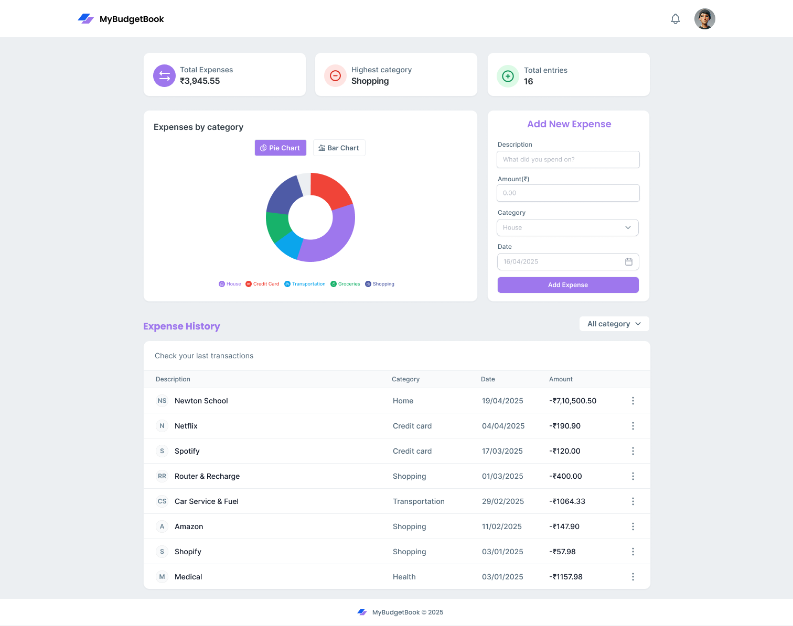

# 💰 MyBudgetBook

**MyBudgetBook** is a modern budget management application that helps users track and manage their personal expenses with clarity and ease. With category-wise breakdowns, visual summaries, and intuitive design, it simplifies financial decision-making and daily budgeting.

🔗 **Live Demo**: [my-budget-book.vercel.app](https://my-budget-book.vercel.app/)

---

## 🚀 Features

- 📊 **Expense Summary Dashboard**  
  View your total expenses, highest category spend, and number of entries at a glance.

- 🧮 **Category-wise Expense Tracking**  
  Organize your spending under categories like food, rent, utilities, transport, etc.

- 📈 **Interactive Charts**  
  Visualize your expenses using donut and pie charts for better insight.

- 🖼️ **Responsive UI**  
  Clean and consistent layout optimized for desktops and tablets.

- 🔔 **Toast Notifications**  
  Get visual feedback for actions using smooth toast alerts.

---

## 🖼️ Screenshots

| Landing Page | Dashboard |
|--------------|-----------|
|  |  |

---

## 🛠️ Tech Stack

- **React.js**
- **Tailwind CSS**
- **Chart.js**
- **React Hot Toast**

---

## 📦 Installation

```bash
git clone https://github.com/omkar-hadole/MyBudgetBook.git
cd MyBudgetBook
npm install
npm run dev
